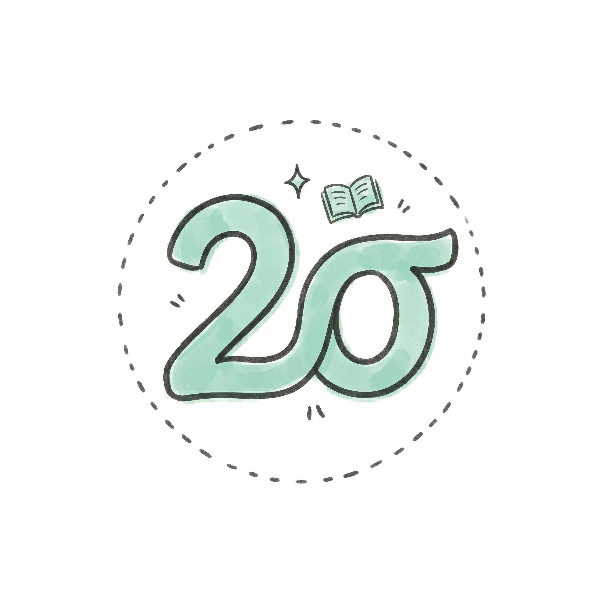
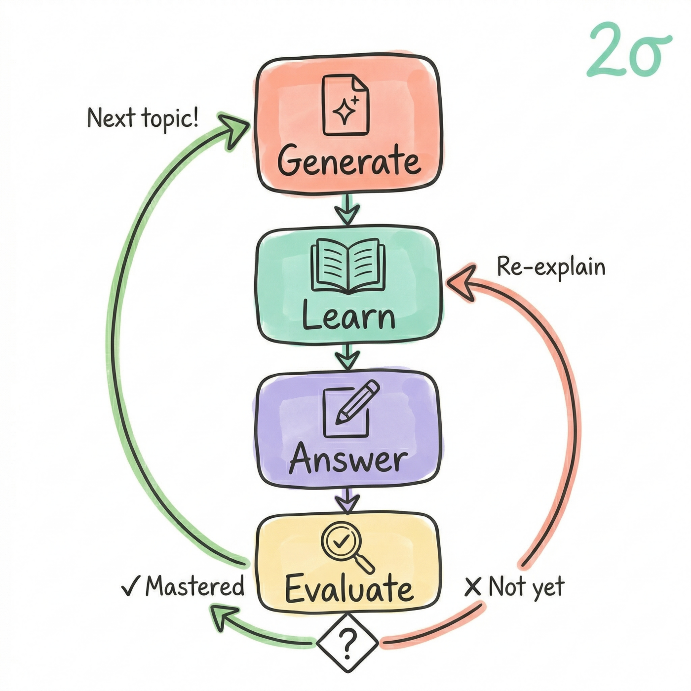
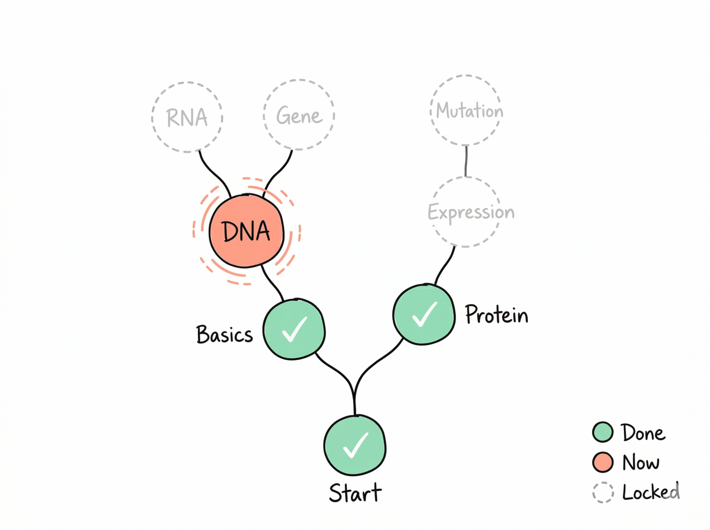

<p align="center">
  
</p>

<h1 align="center">2sigma</h1>

<p align="center">
  <b>AI 私教 · 十倍速进入任何领域</b><br/>
  Your AI private tutor. Learn anything 10x faster.
</p>

<p align="center">
  <a href="README.md">English</a> · <a href="#安装">安装</a>
</p>

---

> **1984年**，教育心理学家布鲁姆发现：接受**一对一辅导**和**掌握式学习**的学生，能超过传统课堂中 **98%** 的学生。他称之为 **2-sigma 问题**——效果整整高出两个标准差。但一个学生配一个导师，成本太高了。这个问题悬而未决了几十年。**直到现在。**

---

## 这是什么？

你有没有这种经历——想进入一个全新领域，入门书太浅看了没用，专业书又啃不动，每看一句话恨不得查半天？

**问题不在于你不够聪明。** 人类的大脑天生需要定制化学习——你需要有人根据你的理解程度，一步步带你走。这就是为什么一对一家教永远比大班课效果好。

但家教太贵了。一小时几百块，学一个新领域可能需要几十个小时。

**2sigma 把你的 AI 变成一个免费的一对一私教。** 不是那种你问它答的聊天机器人——而是它主动给你出题、判断你的理解程度、根据你的反馈调整教学节奏的 **2-sigma 级别的 AI 导师**。

### 为什么不能直接跟 AI 聊天学习？

因为聊天学习把学习流程**搞反了**。

|  | 普通 AI 聊天 | 2sigma |
|---|---|---|
| 谁主导？ | 你问，AI 答 | **AI 出题，你回答** |
| 上下文 | 聊久了就丢失 | **文件永久保存** |
| 进度 | 没有，每次从头开始 | **知识树 + 掌握度追踪** |
| 难度 | 千篇一律 | **根据你的理解自动调节** |
| 科学依据 | 无 | **布鲁姆 2-sigma 方法** |

<p align="center">
  
</p>

当你接触一个完全陌生的领域时，核心困扰是：**你不知道你不知道什么**。你没法提出好问题，因为你还没有足够的知识储备来提问。

一对一辅导之所以有效，就是因为它让**导师主动提问**，你只需要想办法回答。2sigma 就是这个逻辑。

而且，普通 AI 聊天有一个致命问题：**对话框会过期**。你聊了两个小时学了一半，上下文满了，开新对话——你得从头给 AI 解释你学到哪了。

2sigma 把所有学习内容写成文件，存在你电脑上。**学习进度永远不会丢失。**

## 怎么用？

<p align="center">
  
</p>

打开 Claude Code（或 Codex），直接说：

- "帮我学习量子计算"
- "帮我读这篇论文" + 丢一个 PDF
- "帮我复习这本书，准备考试"
- "帮我看看这个 GitHub 项目在干什么"

AI 会：
1. 问你的背景和了解程度
2. 生成第一篇学习文档（像朋友聊天一样讲解，不是教科书）
3. 文档末尾有针对性的提问——不是让你背诵，而是测试你真的理解了
4. 你回答后，AI 评估理解程度，决定继续推进还是换个角度再讲一遍

**这就是布鲁姆的 2-sigma 方法：一对一辅导 + 掌握式学习。**

## 六种学习模式

<p align="center">
  
</p>

| 模式 | 怎么触发 | 做什么 |
|------|---------|--------|
| **论文导读** | "帮我读这篇论文" + PDF/DOI | 把一篇陌生论文拆解成你能理解的知识 |
| **概念学习** | "XXX是什么" / "帮我讲讲XXX" | 从零开始学一个概念，直到你能给别人讲清楚 |
| **领域入门** | "我想入门XXX领域" | 生成学习路线图，按依赖关系逐个击破 |
| **技术栈学习** | "怎么学XXX框架" | 理解工具的设计哲学和核心用法 |
| **代码仓库导读** | 提供 GitHub URL 或本地路径 | 像读论文一样读代码——先看架构，再按需深入 |
| **考试复习** | "帮我复习这本书" + 教材 | 喂一整本书，按章节出题，弱项反复强化 |

## 提问设计

大多数 AI "导师"只会让你复述刚读过的内容。没用。

2sigma 用**信心三明治**来设计问题：

1. **基础题** —— 你读懂了就能答，但必须用自己的话说，不能抄原文
2. **应用题** —— 把概念用到文档没提过的新场景里
3. **挑战题**（可选）—— 综合、评价、辩论。准备好了才出

AI 评估的是你的**整体理解**，不是逐题打分。小错纠正后继续走；根本性误解才会停下来换个方式重新讲。

### 你的知识树

2sigma 会为你构建一棵**知识树**，让你随时知道学到哪了：

- **绿色节点** = 已掌握（你证明了你真的理解了）
- **橙色节点** = 当前正在学
- **灰色虚线节点** = 待解锁（前置知识学完才开放）

随时中断，随时继续。学习进度永远不会丢。

<p align="center">
  
</p>

<a name="安装"></a>

## 安装

#### Claude Code

直接告诉 Claude Code：

> 帮我把 `https://github.com/chenly255/2sigma` 克隆到 `~/.claude/skills/2sigma/`

或者自己运行：

```bash
git clone https://github.com/chenly255/2sigma.git ~/.claude/skills/2sigma
```

#### Codex

告诉 Codex：

> Clone `https://github.com/chenly255/2sigma` to `~/.codex/skills/2sigma/`

或者自己运行：

```bash
git clone https://github.com/chenly255/2sigma.git ~/.codex/skills/2sigma
```

#### 其他 agent（Trae 等）

```bash
git clone https://github.com/chenly255/2sigma.git
# 把 SKILL.md 和 references/ 复制到 agent 读取 skill 文件的目录
```

### PDF 功能（可选）

如果要读论文或教材的 PDF，需要装 [uv](https://docs.astral.sh/uv/)：

```bash
curl -LsSf https://astral.sh/uv/install.sh | sh
```

第一次转换 PDF 时会自动下载模型，之后就不用了。

## 首次设置

首次使用时，skill 会问你几个问题：

- **语言** —— 用你习惯的语言
- **你的背景** —— 这样类比才能让你秒懂
- **文档长度** —— 短（600字）、适中（1000字）、详细（1800字）
- **论文来源** —— Zotero、PDF 文件、在线搜索

设置一次，以后不再问。

## 扩展

想添加新的学习模式？查看 [references/extending.md](references/extending.md)。定义触发词、文档序列和风格规则，掌握式学习循环自动适配。

## 作者

**陈丽盈** — [中山大学](https://www.sysu.edu.cn/) & [广州国家实验室](https://www.gzlab.ac.cn/) 博士生

## 许可证

MIT

---

<p align="center">
  <b>别再"问" AI 了。让 AI 来"教"你。</b>
</p>
